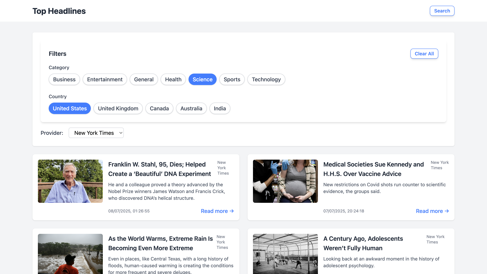
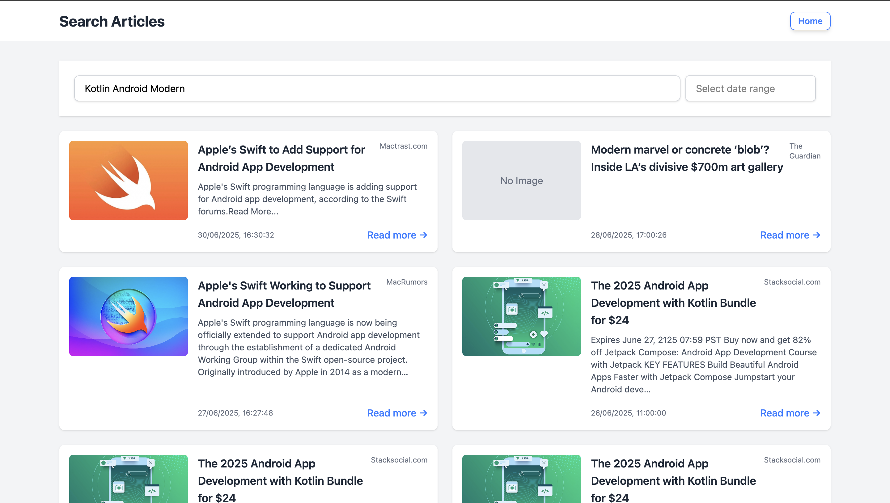

# News Aggregator

A modern, scalable news aggregator web application built with **React**, **TypeScript**, and **Vite**. This project demonstrates:

* **Clean Architecture** principles for frontend apps
* **Atomic Design** methodology for UI components
* Integration with multiple news providers (NewsAPI, The Guardian, New York Times)

> This repository serves as a template for building robust, maintainable, and production-ready React applications at scale.

---

## Table of Contents

* [Features](#features)
* [Screenshots](#screenshots)
* [Tech Stack](#tech-stack)
* [Architecture](#architecture)
* [Getting Started](#getting-started)
* [Project Structure](#project-structure)
* [Environment Variables](#environment-variables)
* [Docker Support](#docker-support)
* [License](#license)

---

## Features

* 🔎 **Multi-provider news search** (NewsAPI, Guardian, NYT)
* 📂 **Category & Country filtering**
* 💡 **Provider selection**
* 🏷️ **Atomic UI components** (atoms, molecules, organisms)
* 🧩 **Pagination**
* ⚡ **Debounced search**
* 💾 **TypeScript-first, typed API responses**
* 🧱 **Clean code and modular architecture**
* 🐳 **Production-ready Dockerfile**

---

## Screenshots




---

## Tech Stack

* **React** (Vite)
* **TypeScript**
* **React Query**
* **Tailwind CSS**
* **Axios**
* **Docker**

---

## Architecture

This project is structured using **Clean Architecture** principles, separating concerns across distinct layers:

* **Presentation**: UI components (atomic design: atoms, molecules, organisms, pages)
* **Domain**: Business logic, use cases, and entities
* **Data**: API clients, data mappers, repositories

This encourages scalable, testable code and easier onboarding for teams.

* **Atomic Design** further organizes UI code into reusable building blocks for clarity and reuse.

---

## Getting Started

### 1. Clone the repository

```bash
git clone https://github.com/yourusername/news-aggregator.git
cd news-aggregator
```

### 2. Install dependencies

```bash
npm install
```

### 3. Set up environment variables

* Copy `.env.example` to `.env` and add your API keys:

```
cp .env.example .env
```

* Edit `.env` and add your API keys for NewsAPI, Guardian, NYT.

### 4. Run locally (development mode)

```bash
npm run dev
```

App will be running at [http://localhost:5173](http://localhost:5173) (or the port shown).

---

## Docker Support

This project ships with a `Dockerfile` for production builds. You can run the app with only Docker installed:

```bash
docker build -t news-aggregator .
docker run -p 8080:80 news-aggregator
```

* The production build is served using **nginx** at [http://localhost:8080](http://localhost:8080)
* Make sure to provide your `.env` file before building the image.

---

## Project Structure

```
├── src/
│   ├── data/            # Data layer: API clients, repositories
│   ├── domain/          # Domain layer: use cases, entities, types
│   ├── presentation/    # UI layer: components, pages (atomic design)
│   ├── hooks/           # Custom React hooks
│   ├── context/         # Context providers
│   ├── utils/           # Utility functions
│   └── ...
├── public/
├── Dockerfile
├── .env.example
├── README.md
└── ...
```

---

## Environment Variables

Create a `.env` file based on `.env.example`:

```
VITE_NEWSAPI_KEY=your_newsapi_key_here
VITE_GUARDIAN_KEY=your_guardian_key_here
VITE_NYT_KEY=your_nytimes_key_here
```

---

## License

MIT
